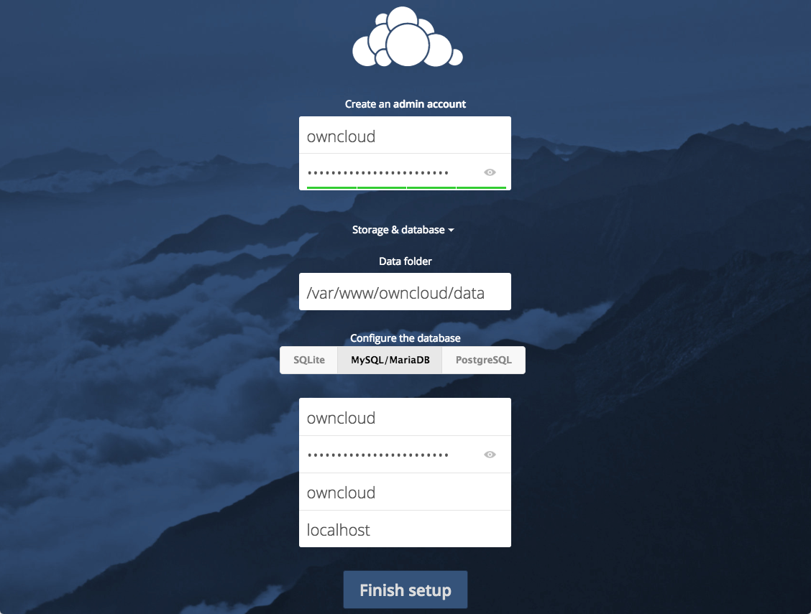

# Introduction

**Welcome to ownCloud** - The content collaboration platform that is open, reliable, secure, and efficient.

Organizations that require to *share sensitive data* with both internal and external users can use ownCloud to share data securely and easily. ownCloud provides organizations with the visibility and control that is required to manage confidential data and enable *digital collaboration*. ownCloud allows users to access data on any device without consideration about where the data is stored while also complying with all your *business processes*.

This Quickstart demonstrates how to quickly install, configure, and use your ownCloud server.

## Installing your ownCloud server on Ubuntu 18.04

This Quickstart guide specifies the steps required to install ownCloud on a fresh installation of Ubuntu 18.04. You require to run the commands in your terminal to complete the installation.

This section describes a quick manual installation on Ubuntu. You can also install ownCloud on different operating systems and using Docker or the Installation Wizard. Based on your organization's requirement of storage, users, high availability, etc., the system requirements also vary. For detailed installation and administration steps, see the [ownCloud Administration Manual](https://doc.owncloud.com/server/admin_manual/).

### Deployment Recommendations

- Operating system: Ubuntu 18.04.

- Web server: Apache 2.4 with [prefork and mod_php](https://doc.owncloud.com/server/admin_manual/installation/manual_installation.html#multi-processing-module-mpm).

- Database: MySQL 8 with InnoDB storage engine.  
- PHP 7.2.

- Set up a scale-out deployment, or using [Federated Cloud Sharing](https://doc.owncloud.com/server/user_manual/files/federated_cloud_sharing.html) to keep individual ownCloud instances to a manageable size.

### Prerequisites

- Fresh install of Ubuntu 18.04 with SSH enabled.
- A non-root user with sudo privileges.
- [Install and configure the LAMP stack](https://www.digitalocean.com/community/tutorials/how-to-install-linux-apache-mysql-php-lamp-stack-ubuntu-18-04): ownCloud requires a web server, a database, and PHP to function optimally. Therefore, you require to set up a LAMP stack (Linux, Apache, MySQL, and PHP) to meet this requirement.
- Set up your SSL certificates.

### Step 1: Installing ownCloud

ownCloud maintains a dedicated repository for Ubuntu that you can add to your server.

1. Download the release key from ownCloud using the following curl command and import it with the add command of the apt-key utility:   
   `curl https://download.owncloud.org/download/repositories/10.0/Ubuntu_18.04/Release.key | sudo apt-key add -`  
   The `Release.key` file contains a PGP (Pretty Good Privacy) public key that `apt` uses to verify the authenticity of the ownCloud package.
2. Create a file called `owncloud.list` in the `sources.list.d` directory for `apt`.   
   `echo 'deb http://download.owncloud.org/download/repositories/10.0/Ubuntu_18.04/ /' | sudo tee /etc/apt/sources.list.d/owncloud.list`  
   This file contains the address to the ownCloud repository.

Now, you can use the package manager to find and install ownCloud. Along with the main p ackage, you can also install a few additional PHP libraries that ownCloud uses to add extra functionality. To update your local package index, and install all the libraries, type the following command:

```
$ sudo apt update
$ sudo apt install php-bz2 php-curl php-gd php-imagick php-intl php-mbstring php-xml php-zip owncloud-files
```

### Step 2: Adjusting the Document Root

The ownCloud package that gets installed copies the web files to the `/var/www/owncloud` file on the server. Currently, the Apache virtual host configuration is set up to serve files out of a different directory. Therefore, you need to change the `DocumentRoot` setting in your configuration to point to a new directory.

You can find which virtual host files reference your domain name or IP address using the `apache2ctl` utility with the `DUMP_VHOSTS` option. Filter the output by the domain name or IP address of your server to find which files you need to edit:  
`sudo apache2ctl -t -D DUMP_VHOSTS | grep server_domain_or_IP`

The output of this command looks something similar to this:   

```
:443                  server_domain_or_IP (/etc/apache2/sites-enabled/server_domain_or_IP-le-ssl.conf:2)
         port 80 namevhost server_domain_or_IP (/etc/apache2/sites-enabled/server_domain_or_IP.conf:1)
```

In the parentheses, you can see each of the files that reference the domain name or IP address that is used to access ownCloud. These are the files you require to edit.

For each match, in a text editor, open the file with `sudo` privileges:  
`$ sudo nano /etc/apache2/sites-enabled/server_domain_or_IP.conf`

Within the file, search for the `DocumentRoot` directive and change the line to point to the `/var/www/owncloud` directory. For example:  

```
                         Example DocumentRoot edit                         

<VirtualHost *:80>
    . . .
    DocumentRoot /var/www/owncloud
    . . .
</VirtualHost>
```

After you have completed editing the file, save and close the file. Complete this process for each of the files that reference your domain name (or IP address if you have not configured a domain for your server).

After completion, check the syntax of your Apache files to make sure there were no detectable typos in your configuration, using the following command:  
`$ sudo apache2ctl configtest`

Restart the Apache service to activate the new changes, using the following command:  
`sudo systemctl reload apache2`  

Apache should now know how to serve your ownCloud files.

### Step 3: Create the MySQL database

1. Log in to the MySQL shell and type the following command:  
   `$ sudo mysql`
2. To create a MySQL database, from within the MySQL shell, type the following command:  
   `CREATE DATABASE owncloud CHARACTER SET utf8mb4 COLLATE utf8mb4_general_ci;`
3. To create a MySQL user account, and grant access to the database, type the following command:  
   `GRANT ALL ON owncloud.* TO 'owncloudsuser'@'localhost' IDENTIFIED BY 'change-with-strong-password';`
4. Run the `flush privileges` command to ensure that the running instance of MySQL knows about the recent privilege assignment:   
   `FLUSH PRIVILEGES;`
5. Exit the MySQL console:  
   `Exit`

Now that you have installed ownCloud, set up the database, and configured all the necessary services, you can configure your ownCloud by opening a web browser and typing `https://server_domain_or_IP/owncloud`, where IP is the IP address of your ownCloud instance.

## Configuring ownCloud

To access the ownCloud web interface, open a web browser and type `https://server_domain_or_IP/owncloud`, where IP is the IP address of your ownCloud instance.

You should see the ownCloud web configuration page in your browser:


Create an admin account by typing a username and password and then click the **Storage & Database** link. Leave the **Data Folder** setting unchanged and click the **MySQL/MariaDB** option, and enter the database information that you have configured previously.



Click **Finish setup** to sign into to ownCloud and open the Web UI of ownCloud:


Administrators can manage users using the user management page of the ownCloud Web UI, and once administrators configure user accounts, they also will be able to access ownCloud using the `https://server_domain_or_IP/owncloud` URL, where IP is the IP address of the ownCloud instance.

For detailed information on configuration of ownCloud, see [ownCloud Administration Manual - Configuration](https://doc.owncloud.com/server/admin_manual/configuration/).

## User Management

Administrators can perform various user management tasks, such as create users, filter users by group, edit user profile details, send automatic email notifications to users, etc. on their ownCloud Web UI.

**Important**: ownCloud administrators must have command line or cron access.

### Creating a new user account

This section describes how an administrator can create a new user account using the ownCloud Web UI.

1. Log into ownCloud using the `https://server_domain_or_IP/owncloud` URL as an administrator.
2. Navigate to the user administration page:  
   
3. To create an ownCloud user, do the following:
    1. Type the ownCloud username and password for the user.  
      **Note**:  You cannot change the ownCloud username once it is created, which become your users' ownCloud user IDs. However, you can edit the user's Full Name and Passwords at any time.
    2. From the Groups drop-down list, select the group to which you want to add the user.  
      **Note**: You have the option to add a user to an existing group, or you can also create a new group for this user. You can create new groups by clicking the **Groups** drop-down list and click add group. You can change the group assignment of users at any time.
    3. Click **Create**.

## Using ownCloud

You can use ownCloud to share files and folders from your computer with other users and synchronize them using your ownCloud server. Once you place files in the shared directories on your device, these files are immediately synchronized with the server and with other devices using the ownCloud Desktop Sync Client, Android app, or iOS app.

ownCloud has client applications for Window, OS X, and Linux desktops, and Android and iOS devices. You can download the client that you require from the [ownCloud Web site](https://owncloud.com/client/). The application for mobile devices is available on Google Play and Apple App Store.

### Configuring the ownCloud Desktop or Mobile Client

Once you have installed the desktop client on your device, do the following to connect to your ownCloud server and synchronize your local files with the ownCloud server:

1. Launch the ownCloud desktop client.  
   This displays the "ownCloud Connection Wizard."
2. In the `Setup ownCloud server` screen, in the **Server Address** field, enter the IP address of your ownCloud server.
3. In the `Enter user credentials` screen, enter the username and password of your ownCloud user account and click **Next**.
4. In the `Setup local folder options` screen, specify whether you want to sync all of your files or only selected files and folders on the ownCloud server.   
     
   The default local sync folder, where you store the files that you want to synchronize with the ownCloud server, is located in your home directory and named `ownCloud`.  You can also change the default local sync folder.
5. Click **Connect** and then **Finish** to save the settings.   
   Once you click **Connect**, the client attempts to connect to your ownCloud server, and when it is successful, you will see two buttons: one to connect to your ownCloud Web UI and the other one to open your local folder. The client will also start synchronizing your files.

 
