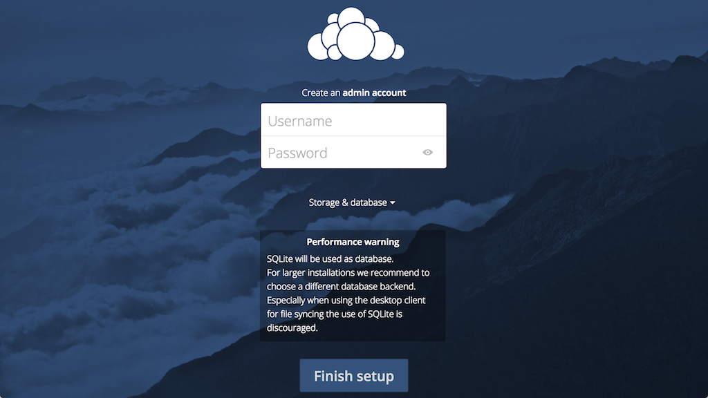
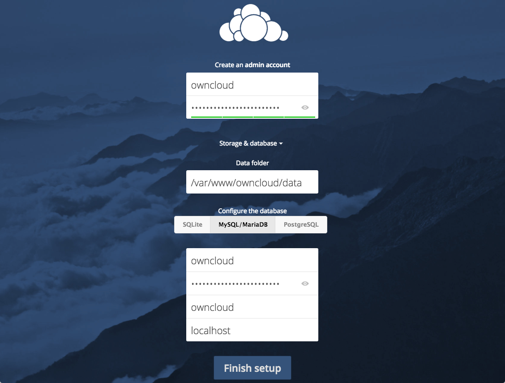
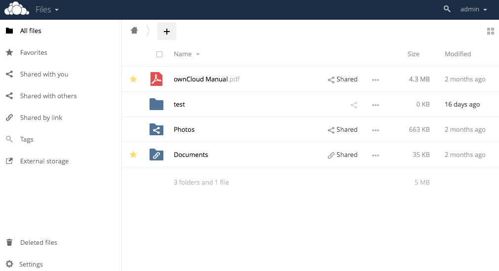

# Introduction

**Welcome to ownCloud** - The content collaboration platform that is open, reliable, secure, and efficient. 

Organizations that require to *share sensitive data* with both internal and external users can use ownCloud to share data securely and easily. ownCloud provides organizations with the visibility and control that is required to manage confidential data and enable *digital collaboration*. ownCloud enables users to access data on any device without consideration about where the data is stored while also complying with all your *business processes*.

This QuickStart demonstrates how you can quickly install and configure your ownCloud server.

## Installing your ownCloud Server 

### Deployment Recommendations

This Quick Start guide describes the installation of the ownCloud using the following specifications: 

- Operating system: Ubuntu 18.04.

- Web server: Apache 2.4 with [prefork and mod_php](https://doc.owncloud.com/server/admin_manual/installation/manual_installation.html#multi-processing-module-mpm).

- Database: MySQL 8 with InnoDB storage engine.  
- PHP 7.2.

- Consider setting up a scale-out deployment, or using [Federated Cloud Sharing](https://doc.owncloud.com/server/user_manual/files/federated_cloud_sharing.html) to keep individual ownCloud instances to a manageable size.

**Important**: Apart from the recommendation above, depending on your organization's requirement of storage, users, high availability, etc., you will have specific system requirements that you require to meet to install your OwnCloud server. For specific system requirements for small workgroups, mid-size enterprises, and large enterprises, see the [ownCloud Administration Manual](https://doc.owncloud.com/server/admin_manual/). The ownCloud Administration Manual also covers information about Operating systems, Authentication, Backup processes, etc.

### Installation on Ubuntu 18.04

This section specifies the steps required to install ownCloud on a fresh installation of Ubuntu 18.04. You require to run the commands in your terminal to complete the installation.

**Important**: ownCloud administrators must have command line or cron access.

This section describes a quick manual installation, and you can also install ownCloud using Docker or the Installation Wizard. For detailed steps for the different installation options, see [ownCloud Administration Manual - Installation Options](https://doc.owncloud.com/server/admin_manual/installation/).

#### Prerequisites 

- Fresh install of Ubuntu 18.04 with SSH enabled.
- Ensure that all the installed packages are up to date using the following command:  
  `sudo apt update && sudo apt upgrade -y`\

#### Preparation

##### Create the occ helper script to simplify running occ commands

```
FILE="/usr/local/bin/occ"
/bin/cat <<EOM >$FILE
#! /bin/bash

cd /var/www/owncloud
sudo -u www-data /usr/bin/php /var/www/owncloud/occ "\$@"
EOM
sudo chmod +x /usr/local/bin/occ
```

##### Install the Required Packages

```
sudo apt install -y \
  apache2 \
  libapache2-mod-php7.2 \
  mariadb-server \
  openssl \
  php-imagick php7.2-common php7.2-curl \
  php7.2-gd php7.2-imap php7.2-intl \
  php7.2-json php7.2-mbstring php7.2-mysql \
  php-ssh2 php7.2-xml php7.2-zip \
  php-apcu php-redis redis-server \
  wget
```

##### Install the Recommended Packages

```
sudo apt install -y \
  ssh bzip2 rsync curl jq \
  sudo inetutils-ping \
  smbclient php-smbclient coreutils php7.2-ldap
```

**Warning**: Ubuntu 18.04 includes smbclient 4.7.6, which has a known limitation of only using version 1 of the SMB protocol.

#### Installation Process

##### Configure Apache

Change the Document Root

```
sudo sed -i "s#html#owncloud#" /etc/apache2/sites-available/000-default.conf

sudo service apache2 restart
```

Create a Virtual Host Configuration

```
FILE="/etc/apache2/sites-available/owncloud.conf"
sudo /bin/cat <<EOM >$FILE
Alias /owncloud "/var/www/owncloud"

<Directory /var/www/owncloud>
  Options +FollowSymlinks
  AllowOverride All

 <IfModule mod_dav.c>
  Dav off
 </IfModule>

 SetEnv HOME /var/www/owncloud
 SetEnv HTTP_HOME /var/www/owncloud
</Directory>
EOM
```

Enable the Virtual Host Configuration

```
sudo a2ensite owncloud.conf
sudo service apache2 reload
```

##### Configure the Database

```
mysql -u root -e "CREATE DATABASE IF NOT EXISTS owncloud; \
GRANT ALL PRIVILEGES ON owncloud.* \
  TO owncloud@localhost \
  IDENTIFIED BY 'password'";
```

Enable the Recommended Apache Modules

```
echo "Enabling Apache Modules"

sudo a2enmod dir env headers mime rewrite setenvif
sudo service apache2 reload
```

##### Setup ownCloud

Download ownCloud

```
sudo -u www-data wget -P=/var/www https://download.owncloud.org/community/owncloud-10.2.0.tar.bz2 && \
  sudo tar -xjf owncloud-10.2.0.tar.bz2 && \
  sudo chown -R www-data /var/www/owncloud
```

Install ownCloud

```
occ maintenance:install \
    --database "mysql" \
    --database-name "owncloud" \
    --database-user "owncloud" \
    --database-pass "password" \
    --admin-user "admin" \
    --admin-pass "admin"
```

Configure the Trusted Domains for ownCloud

```
myip=$(hostname -I|cut -f1 -d ' ')
occ config:system:set trusted_domains 1 --value="$myip"
```

Set Up a Cron Job

```
echo "*/15  *  *  *  * /usr/bin/php -f /var/www/owncloud/cron.php" \
  > /var/spool/cron/crontabs/www-data
sudo -u www-data chown www-data.crontab /var/spool/cron/crontabs/www-data
sudo -u www-data chmod 0600 /var/spool/cron/crontabs/www-data
```

Configure Caching and File Locking

Add the following to the configuration information present in the `/var/www/owncloud/config/config.php` file.

```
<?php
// ...remaining configuration
'memcache.local' => '\OC\Memcache\APCu',
'memcache.locking' => '\OC\Memcache\Redis',
'redis' => [
    'host' => 'localhost',
    'port' => 6379,
],
```

Configure Log Rotation

```
FILE="/etc/logrotate.d/owncloud"
sudo /bin/cat <<EOM >$FILE
/var/www/owncloud/data/owncloud.log {
  size 10M
  rotate 12
  copytruncate
  missingok
  compress
  compresscmd /bin/gzip
}
EOM
```

##### Finalise the Installation

```
FILE="/usr/local/bin/ocpermissions"

/bin/cat <<EOM >$FILE
#!/bin/bash

ocpath="/var/www/owncloud"
datadir="/var/www/owncloud/data"
htuser="www-data"
htgroup="www-data"
rootuser="root"

printf "Creating any missing directories"
sudo -u www-data mkdir -p "$ocpath/assets"
sudo -u www-data mkdir -p "$ocpath/updater"
sudo -u www-data mkdir -p "$datadir"

printf "Update file and directory permissions"
sudo find "${ocpath}/" -type f -print0 | xargs -0 chmod 0640
sudo find "${ocpath}/" -type d -print0 | xargs -0 chmod 0750

printf "Set web server user and group as ownCloud directory user and group"
sudo chown -R "${rootuser}:${htgroup}" "${ocpath}/"
sudo chown -R "${htuser}:${htgroup}" "${ocpath}/apps/"
sudo chown -R "${htuser}:${htgroup}" "${ocpath}/apps-external/"
sudo chown -R "${htuser}:${htgroup}" "${ocpath}/assets/"
sudo chown -R "${htuser}:${htgroup}" "${ocpath}/config/"
sudo chown -R "${htuser}:${htgroup}" "${datadir}"
sudo chown -R "${htuser}:${htgroup}" "${ocpath}/updater/"
sudo chmod +x "${ocpath}/occ"

printf "Set web server user and group as .htaccess user and group"
if [ -f "${ocpath}/.htaccess" ]; then
  sudo chmod 0644 "${ocpath}/.htaccess"
  sudo chown "${rootuser}:${htgroup}" "${ocpath}/.htaccess"
fi

if [ -f "${datadir}/.htaccess" ]; then
  sudo chmod 0644 "${datadir}/.htaccess"
  sudo chown "${rootuser}:${htgroup}" "${datadir}/.htaccess"
fi

EOM

# Make the script executable
sudo chmod +x /usr/local/bin/ocpermissions

ocpermissions
```

This completes the installation of ownCloud. You can confirm that it is ready to use by pointing your web browser to your ownCloud installation.

## Configuring ownCloud 

To access the ownCloud web interface, open a web browser and type `https://server_domain_or_IP/owncloud`, where IP is the IP address of your ownCloud instance.

You should see the ownCloud web configuration page in your browser: 



Create an admin account by typing a username and password and then click the **Storage & Database** link. Leave the **Data Folder** setting unchanged and click the **MySQL/MariaDB** option, and enter the database information that you have configured previously. 



Click **Finish setup** to sign into to ownCloud and open the Web UI of ownCloud:



Administrators can manage users using the user management page of the ownCloud Web UI, and once administrators configure user accounts, they also will be able to access ownCloud using the `https://server_domain_or_IP/owncloud` URL, where IP is the IP address of the ownCloud instance.

For detailed information on configuration of ownCloud, see ownCloud Administration Manual - Configuration](https://doc.owncloud.com/server/admin_manual/configuration/).

## User Management

Administrators can perform various user management tasks, such as create users, filter users by group, edit user profile details, send automatic email notifications to users, etc. on their ownCloud Web UI.

### Creating a new user account

This section describes how an administrator can create a new user account using the ownCloud Web UI.

1. Log into ownCloud using the `https://server_domain_or_IP/owncloud` URL as an administrator.
2. Navigate to the user administration page:  
   
3. To create an ownCloud user, do the following:
    1. Type the ownCloud username and password for the user.  
      **Note**:  You cannot change the ownCloud username once it is created, which become your users' ownCloud user IDs. However, you can edit the user's Full Name and Passwords at any time.
    2. From the Groups drop-down list, select the group to which you want to add the user.  
      **Note**: You have the option to add a user to an existing group, or you can also create a new group for this user. You can create new groups by clicking the **Groups** drop-down list and click add group. Group assignments can be changed at any time.
    3. Click **Create**.

## Using ownCloud

You can use ownCloud to share files and folders from your computer with other users and synchronize them using your ownCloud server. Once you place files in the shared directories on your device, these files are immediately synchronized with the server and with other devices using the ownCloud Desktop Sync Client, Android app, or iOS app. 

ownCloud has client applications for Window, OS X, and Linux desktops, and for Android and iOS devices. You can download the client that you require from the [ownCloud Web site](https://owncloud.com/client/). The application for mobile devices is available on Google Play and Apple App Store.

### Configuring the ownCloud Desktop or Mobile Client

Once you have installed the desktop client on your device, do the following to connect to your ownCloud server and synchronize your local files with the ownCloud server:

1. Launch the ownCloud desktop client.  
   This displays the "ownCloud Connection Wizard."
2. In the `Setup ownCloud server` screen, in the **Server Address** field, enter the IP address of your ownCloud server. 
3. In the `Enter user credentials` screen, enter the username and password of your ownCloud user account and click **Next**.
4. In the `Setup local folder options` screen, specify whether you want to sync all of your files or only selected files and folders on the ownCloud server.   
     
   The default local sync folder, where you store the files that you want to synchronize with the ownCloud server, is located in your home directory and named `ownCloud`.  You can also change the default local sync folder.
5. Click **Connect** and then **Finish** to save the settings.   
   Once you click **Connect**, the client attempts to connect to your ownCloud server, and when it is successful, you will see two buttons: one to connect to your ownCloud Web UI and the other one to open your local folder. The client will also start synchronizing your files.

 