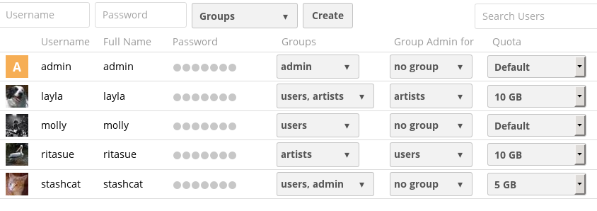

# User Management

Administrators can perform various user management tasks, such as create users, filter users by group, edit user profile details, send automatic email notifications to users, etc. on their ownCloud Web UI.

This section describes how an administrator can create a new user account using the ownCloud Web UI.

## Creating a new user account

1. Log into ownCloud using the `https://server_domain_or_IP/owncloud` URL as an administrator.
2. Navigate to the user administration page:  
   
3. To create an ownCloud user, do the following:
    1. Type the ownCloud username and password for the user.  
      **Note**:  You cannot change the ownCloud username once it is created, which become your users' ownCloud user IDs. However, you can edit the user's Full Name and Passwords at any time.
    2. From the Groups drop-down list, select the group to which you want to add the user.  
      **Note**: You have the option to add a user to an existing group, or you can also create a new group for this user. You can create new groups by clicking the **Groups** drop-down list and click add group. Group assignments can be changed at any time.
    3. Click **Create**.
